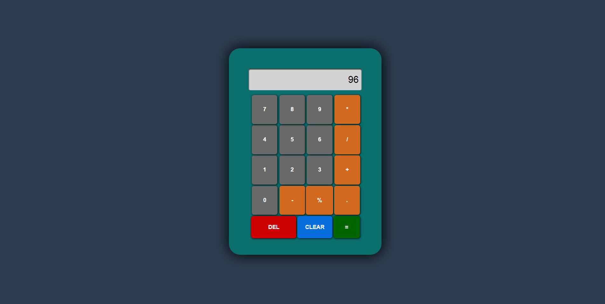

# Calculator
<strong>Language: HTML/CSS+JavaScript</strong>

**Phase:**
* Project Scope: Complete
* Wireframes and Architecture: Complete
* Visual Design: Complete
* Development: Complete
* Testing: Complete
* Deployment: Complete

**Things Learned:**
* The conditional (ternary) operator
* If statement shorthand

This is how the calculator look currently.
